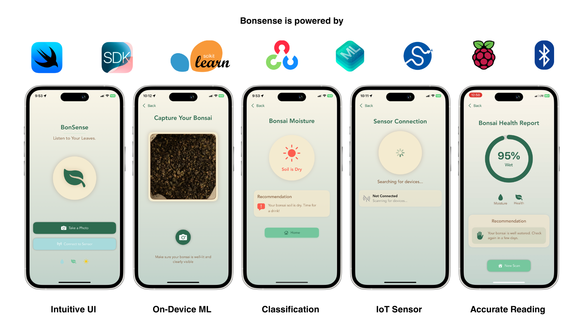
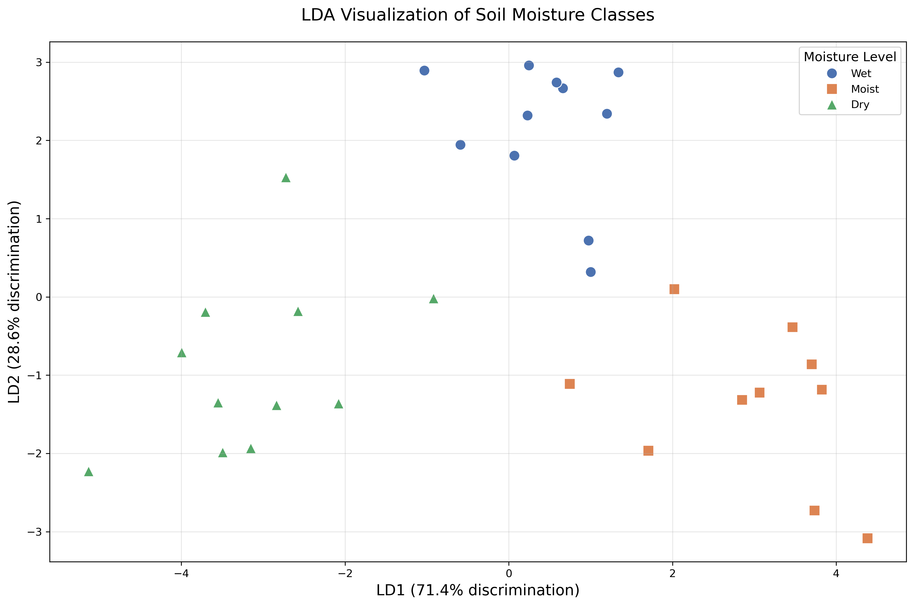
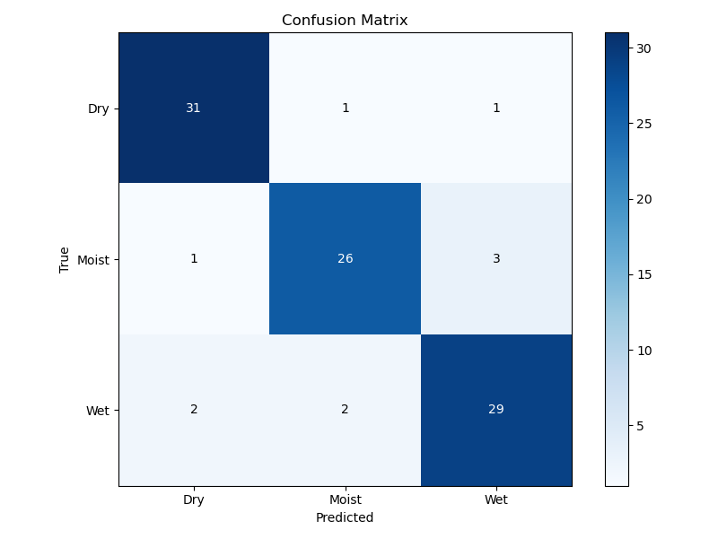
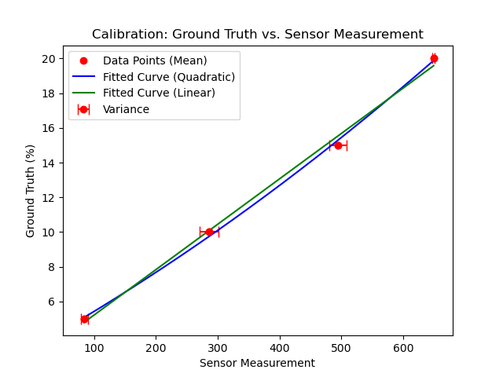
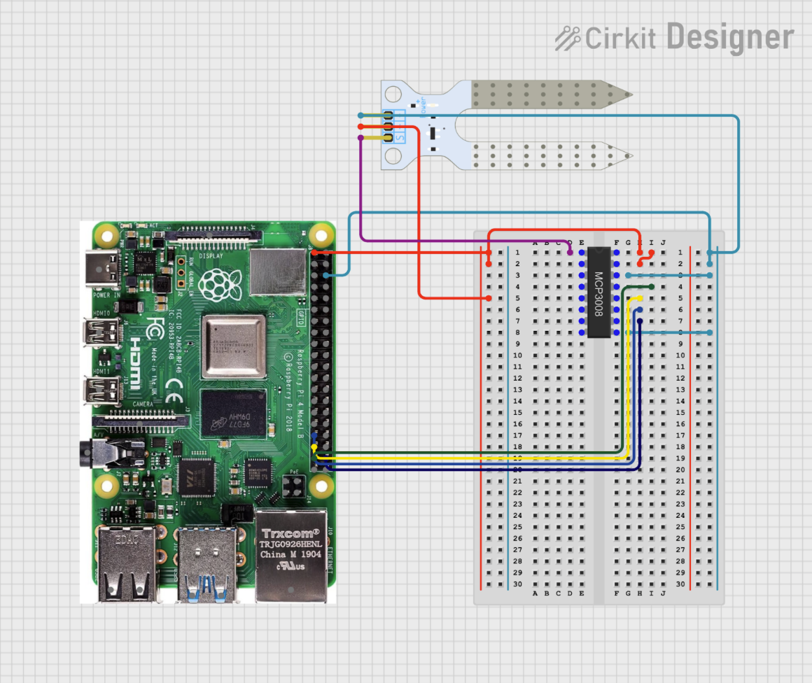

# Bonsense -- Bonsai soil moisutre analysis

Bonsai soil, characterized by its composition of aggregate rocks and limited organic matter, presents unique moisture retention challenges compared to regular soil. This project, a collaboration with the _Toronto Bonsai Society_ as part of the Engineering Science Praxis II course at the _University of Toronto_, **addresses the difficulty beginners face in intuitively determining optimal watering times**. We introduce "Bonsense", a user-friendly, accurate, and rapid soil moisture monitoring system. Our solution integrates a mobile application leveraging machine learning with an IoT sensor setup (conductance sensor and Raspberry Pi).

While we do not intend to commercialize this system due to the associated costs of components like the Apple Developer license and Raspberry Pi, our code is open-source. We encourage contributions and questions to further enhance this project.

## Project Overview

- **Objective**: Develop a reliable and efficient system for monitoring bonsai soil moisture.
- **Methodology**: Combine image analysis via machine learning with IoT sensor data.
- **Components**:
  - iOS mobile application.
  - Conductance sensor.
  - Raspberry Pi.
- **Target Audience**: Beginner bonsai enthusiasts.

## Data Analysis and Machine Learning

Our approach leverages on-device machine learning to estimate soil moisture from simple images, a method enabled by advancements in representational learning and computer vision. We compiled a custom dataset of soil images using the gravimetric method. Analysis, including feature selection and preprocessing, is documented in the `analysis/` folder, showcasing techniques such as PCA, TSNE, and LDA. We found that:

- Dimensionality reduction techniques effectively separate data into distinct clusters in 2D space.
- LDA and PCA capture 80-100% of variance with only two components.

We explored various preprocessing and augmentation techniques to optimize model performance.

We developed and evaluated the following models, with performance metrics summarized below (see `model/` folder):

| Algorithm / Model                     | With Image Augmentation | Accuracy | F1 (average) |
| :------------------------------------ | :---------------------- | :------- | :----------- |
| K-Nearest Neighbour (KNN)            | Yes                     | 64%      | 0.6          |
| Support Vector Machine (SVM)          | No                      | 69%      | 0.7          |
| Support Vector Machine (SVM)          | Yes                     | 77%      | 0.8          |
| Linear Discriminant Analysis (LDA) with SVM | No                      | 79%      | 0.8          |
| Linear Discriminant Analysis (LDA) with SVM | Yes                     | 90%      | 0.9          |
| Light gradient boosting machine (LightGBM) | No                      | 34%      | 0.3          |
| Convolutional Neural Network (CNN)    | No                      | 35%      | 0.3          |

> ![IMPORTANT]
> During testing, we found that lighting condition is a significant factor affecting the model's performance. We recommend using a consistent natural sunlight or indoor LED light source. We might release new preprocessing techniques to mitigate this issue in the future.

The LDA-SVM model was selected for deployment, achieving a 90% accuracy and 0.9 F1 score. The confusion matrix is shown below:

> ![NOTE]
> We also experimented with a public dataset from [akabircs/Soil-Moisture-Imaging-Data](https://github.com/akabircs/Soil-Moisture-Imaging-Data), but achieved better results with our custom dataset and methodology.

## Conductance Sensor

Our experiments demonstrated the viability of conductance sensors for bonsai soil moisture measurement, achieving 90% accuracy after polynomial regression calibration on our dataset, despite being similar in principle with commercial ones that do not adapt well to bonsai soil. The sensor data is processed on the Raspberry Pi and transmitted to the iOS app via Bluetooth Low Energy (BLE) using `bless`. The specific sensor we used is [Gravity Analog Soil Moisture Sensor](https://www.dfrobot.com/product-599.html?srsltid=AfmBOoptYJ0QqSPMzEEFj-cgc-Ezl71hjjr_GMh55PIFPzRnbPnGNSgtg0E) from DFRobot.

> [!NOTE]
> A capacitance sensor has shown to be more longetive and accurate than a conductance sensor. However, it is also more expensive and we do not have access to one.

For insights into BLE implementation, refer to our documentation [here](firmware/ble.md).

Note that since the Raspberry Pi does not have analog input pins, we need to use an ADC (Analog to Digital Converter) to read the analog voltage from the sensor. This would not be an issue if you instead choose Arduino or ESP32/8266. We used the MCP3008 ADC with the following wiring:

## iOS Application

The iOS app, built with SwiftUI and Swift, deploys a CoreML version of our `scikit-learn` model (converted using `coremltools`). It utilizes `AVFoundation` for camera access, `CoreBluetooth` for BLE communication, and `opencv2` for image feature extraction (ported to Swift via Objective-C++). Model inference and preprocessing are efficient, taking only 0.4 seconds with a 6kB model size.

> [!IMPORTANT]
>`coremltools` only supports a very limited set of `scikit-learn` models, for example we could not easily convert LDA to CoreML format

For OpenCV integration in Swift, [this guide](https://medium.com/@hdpoorna/integrating-opencv-to-your-swift-ios-project-in-xcode-and-working-with-uiimages-4c614e62ac88) was invaluable.

## References

1. [Machine Learning Techniques for Estimating Soil Moisture from Smartphone Captured Images](https://doi.org/10.3390/agriculture13030574)

2. [Estimating soil water content from surface digital image gray level measurements under visible spectrum](https://cdnsciencepub.com/doi/10.4141/cjss10054)

3. [Near-infrared spectroscopy for soil water determination in small soil volumes](https://cdnsciencepub.com/doi/10.4141/S03-090)
